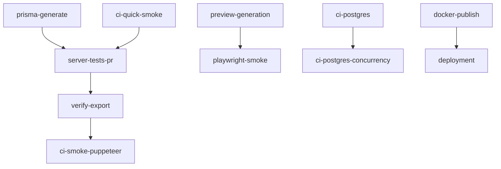

# GitHub Workflows (Revised)

Last updated: November 2, 2025

This document provides a comprehensive summary and assessment of all GitHub Actions workflows in this repository.

## Workflow Categories

### Core Testing Workflows

- **`server-tests-pr.yml`**

  - PR workflow for server unit/integration tests
  - Runs Vitest test suite
  - Includes explicit worker E2E test
  - Uses mock PDF generation in CI

- **`ci-quick-smoke.yml`**
  - Fast PR validation
  - Verifies server startup
  - Checks `/health` endpoint
  - Non-blocking design for quick feedback

### Export and PDF Generation

- **`ci-smoke-puppeteer.yml`**

  - Nightly and push-triggered full export testing
  - Uses real Puppeteer/Chrome for PDF generation
  - Produces debug artifacts (PDF + logs)
  - Strict gating for export functionality

- **`verify-export.yml`**
  - Lightweight in-process export verification
  - Quick feedback without browser dependencies
  - Used in PR validation
  - Focuses on core export logic

### Preview Generation

- **`ci-playwright-generate-preview.yml`**

  - Tests preview generation pipeline
  - Validates HTML output
  - Checks preview rendering
  - Ensures template consistency

- **`playwright-smoke.yml`**
  - Manual preview testing workflow
  - Configurable target URL testing
  - Generates preview artifacts
  - Used for deployment validation

### Database Operations

- **`prisma-generate.yml`**

  - Manages database schema generation
  - Runs Prisma migrations
  - Validates database structure
  - Critical for data model changes

- **`ci-postgres.yml`**

  - PostgreSQL-specific testing
  - Validates database operations
  - Tests data persistence
  - Ensures SQL query performance

- **`ci-postgres-concurrency.yml`**
  - Tests concurrent database operations
  - Validates transaction handling
  - Checks race conditions
  - Ensures data consistency

### Deployment

- **`docker-publish.yml`**
  - Builds and publishes Docker images
  - Runs on schedule and tags
  - Includes security signing
  - Manages deployment artifacts

## Workflow Dependencies



## Environment Requirements

### Chrome/Chromium Dependencies

- System-level Chrome/Chromium required for:
  - Puppeteer tests
  - PDF generation
  - Preview generation
  - Integration tests

### Database Requirements

- PostgreSQL instance needed for:
  - Schema validation
  - Migration testing
  - Concurrency tests
  - Integration tests

### Environment Variables

```bash
# Browser Configuration
CHROME_PATH=/usr/bin/google-chrome-stable
PUPPETEER_SKIP_CHROMIUM_DOWNLOAD=true

# Database Configuration
DATABASE_URL=postgresql://...
USE_PRISMA_IN_TEST=true

# Test Configuration
SKIP_PUPPETEER=true  # For unit tests
PDF_GENERATOR_IMPL=mock  # For CI
```

## Workflow Assessment

### Strengths

1. Comprehensive test coverage
2. Clear separation of concerns
3. Efficient PR validation
4. Strong export validation
5. Robust database testing

### Areas for Enhancement

1. Consider nightly full test suite
2. Add performance benchmarking
3. Enhance artifact retention
4. Implement parallel testing
5. Add cross-browser testing

## CI Performance Optimization

### Current Optimizations

- Mock PDF generation in CI
- Skipped Chromium download
- Efficient smoke tests
- Parallel job execution

### Suggested Improvements

- Cache npm dependencies
- Optimize Docker layers
- Reduce artifact sizes
- Implement test sharding

## Pre-flight Validation

### verify-ci-env.sh

```bash
# Key checks performed:
- Chrome/Chromium installation
- Environment variables
- System dependencies
- Database availability
```

### Local Testing

```bash
# Validate CI environment
./scripts/verify-ci-env.sh

# Run server tests
npm --prefix server test

# Verify export
npm --prefix server run verify-export:inproc
```

## Monitoring and Debugging

### Artifact Collection

- Server logs
- Test results
- Generated PDFs
- Preview outputs
- Database dumps

### Debug Information

- Environment variables
- System configuration
- Browser versions
- Database state

## Future Considerations

### Planned Improvements

1. Nightly regression testing
2. Enhanced performance monitoring
3. Cross-platform testing
4. Security scanning integration
5. Automated dependency updates

### Migration Notes

- See WORKFLOWS_legacy.md for format migration details
- Review CI optimization opportunities
- Monitor workflow execution times
- Track artifact storage usage

## Notes

- All workflows validate using verify-ci-env.sh
- Docker builds include test dependencies
- Database tests require PostgreSQL
- Preview generation needs Chrome
- Artifacts retained for debugging

## References

- GitHub Actions documentation
- Prisma migration guide
- Docker multi-stage builds
- Playwright testing guide
- PostgreSQL concurrency docs
