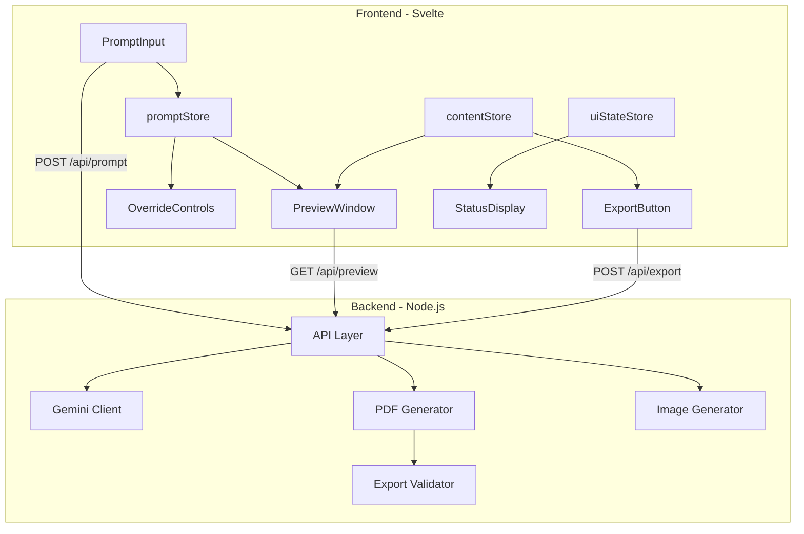
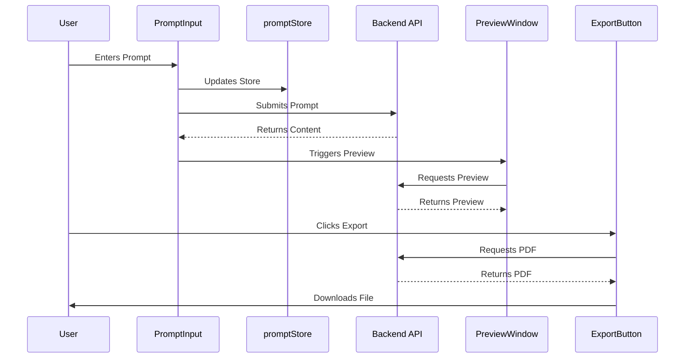

# AetherPress Technical Implementation Guide

## Architecture Overview



## Component Architecture

### Frontend Components

#### 1. Store Management

```javascript
// Key Stores
promptStore; // Manages current prompt text
contentStore; // Handles generated content state
uiStateStore; // Manages UI state and feedback
previewStore; // Handles preview rendering state
```

#### 2. Main Components

##### PromptInput.svelte

- **Purpose**: Primary user input interface
- **Key Features**:
  - Prompt validation
  - Generation triggering
  - Auto-preview initiation
  - Smoke test capability
- **State Management**:
  - Uses promptStore for input
  - Updates contentStore on generation
  - Updates uiStateStore for status

##### PreviewWindow.svelte

- **Purpose**: Real-time content preview
- **Features**:
  - Dynamic background handling
  - Debounced updates
  - Auto-scaling
- **State Dependencies**:
  - Subscribes to contentStore
  - Updates previewStore

##### ExportButton.svelte

- **Purpose**: PDF generation and download
- **Features**:
  - Progress tracking
  - Error handling
  - Download management
- **State Dependencies**:
  - Reads from contentStore
  - Updates uiStateStore

### Backend Services

#### 1. API Layer

- Endpoint Structure:
  ```
  POST /api/prompt   - Content generation
  GET  /api/preview  - Preview rendering
  POST /api/export   - PDF export
  ```

#### 2. Content Generation

- Integration with Gemini AI
- Content validation
- Error handling
- Rate limiting

#### 3. PDF Generation

- Template rendering
- Image processing
- Quality validation
- Caching strategy

## Data Flow



## Error Handling

### Frontend Error Management

```javascript
try {
  // Operation (generation/preview/export)
} catch (error) {
  uiStateStore.set({
    status: "error",
    message: error.message,
  });
}
```

### Backend Error Handling

```javascript
try {
  // Service operation
} catch (error) {
  logger.error(error);
  return res.status(500).json({
    error: error.message,
  });
}
```

## Performance Optimizations

1. **Frontend**

   - Debounced preview updates
   - Image preloading
   - State management optimization

2. **Backend**
   - Response caching
   - Image optimization
   - PDF stream handling

## Development Tools

### Testing

- End-to-end tests using Puppeteer
- Unit tests with Vitest
- Smoke test functionality

### Debugging

- Browser DevTools for frontend
- Node.js debugging for backend
- PDF validation tools

## Deployment Considerations

1. **Environment Variables**

   ```
   NODE_ENV=production
   API_KEY=xxx
   PDF_QUALITY=high
   ```

2. **Build Process**

   ```bash
   # Frontend
   npm run build

   # Backend
   npm run build:server
   ```

3. **Monitoring Points**
   - API response times
   - PDF generation duration
   - Error rates
   - Resource usage

## Security Considerations

1. **Input Validation**

   - Prompt sanitization
   - File type verification
   - Size limitations

2. **Output Validation**

   - Content filtering
   - PDF security checks
   - Image validation

3. **API Security**
   - Rate limiting
   - CORS configuration
   - Request validation

---

_Note: This technical documentation is maintained alongside the user interaction guide. For user-facing documentation, see USER_INTERACTION_GUIDE.md_
