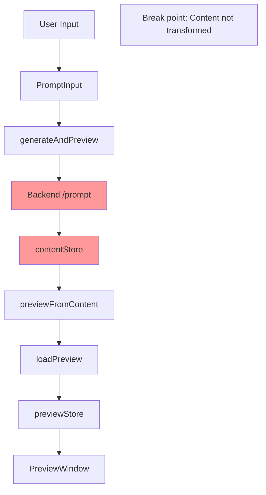

# Preview Chain Disconnect Analysis

## Background

During E2E testing and development, we discovered a critical disconnect between successful test execution and actual frontend preview functionality. This document analyzes the issue and outlines the solution path.

## Current State

### Test Success

E2E tests are passing because:

1. Store updates occur correctly
2. Preview flow executes without errors
3. Global test markers are properly set:
   - `window.__LAST_PREVIEW_HTML`
   - `window.__preview_html_snippet`
   - `window.__LAST_PREVIEW_SET`

### Actual Behavior

Frontend preview fails to show generated content because:

1. Raw prompt text is being displayed instead of generated content
2. Preview HTML structure is correct but contains unprocessed input
3. Backend generation step is either being skipped or its results aren't propagating

### The Disconnect



Current preview content shows:

```html
<h1>Prompt: E2E smoke: short summer poem about</h1>
<div class="content">E2E smoke: short summer poem about waves and sand</div>
```

Instead of actual generated content, we're seeing:

- Title: Raw prompt prefix
- Content: Complete raw prompt
- No transformation or generation occurring

## Root Cause Analysis

1. Data Flow Issue

   - Backend `/prompt` endpoint may not be generating content
   - Generated content might not be properly integrated into preview chain
   - No validation to ensure content is actually generated

2. Test vs Reality

   - Tests verify mechanics (store updates, preview rendering)
   - But don't validate content quality or transformation
   - Success criteria needs to include content verification

3. Content Validation Gap
   - No distinction between raw and generated content
   - Missing validation in preview chain
   - No content type markers or verification

## Action Items

### [ ] 1. Backend Generation Verification

- [ ] Audit `/prompt` endpoint implementation
- [ ] Add logging to track generation steps
- [ ] Verify LLM/generation service integration
- [ ] Add generation status to response

### [ ] 2. Content Flow Enhancement

- [ ] Add content type markers (raw vs. generated)
- [ ] Implement content validation in `previewFromContent`
- [ ] Add transformation verification steps
- [ ] Track content state through preview chain

### [ ] 3. Preview Chain Hardening

- [ ] Add content quality checks
- [ ] Implement preview validation hooks
- [ ] Add error handling for incomplete generation
- [ ] Create preview content schema

### [ ] 4. Test Enhancement

- [ ] Add content quality assertions to E2E tests
- [ ] Create preview content validation tests
- [ ] Add generation verification checks
- [ ] Implement preview content matchers

### [ ] 5. UI Improvements

- [ ] Add loading states for generation
- [ ] Implement error states for failed generation
- [ ] Add visual indicators for content state
- [ ] Improve preview refresh handling

## Implementation Strategy

1. First Phase (Investigation)

   - Implement backend logging
   - Add content flow tracking
   - Create content validation checks

2. Second Phase (Fixes)

   - Fix backend generation
   - Implement content validation
   - Update preview chain

3. Third Phase (Hardening)
   - Enhance tests
   - Add UI improvements
   - Implement error handling

## Success Criteria

1. Generated Content

   - Preview shows actual generated content
   - Content is properly transformed
   - Generation status is tracked

2. Validation

   - Content type is verified
   - Generation completion is confirmed
   - Preview quality is checked

3. User Experience
   - Clear loading states
   - Error handling for failures
   - Visual feedback for content state

## Notes

- This fix addresses both the immediate preview issue and underlying validation gaps
- Implementation will improve overall system reliability
- Enhanced testing will prevent similar issues in future
