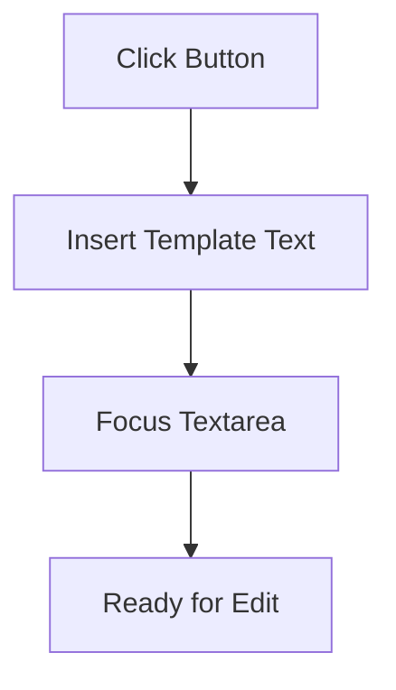
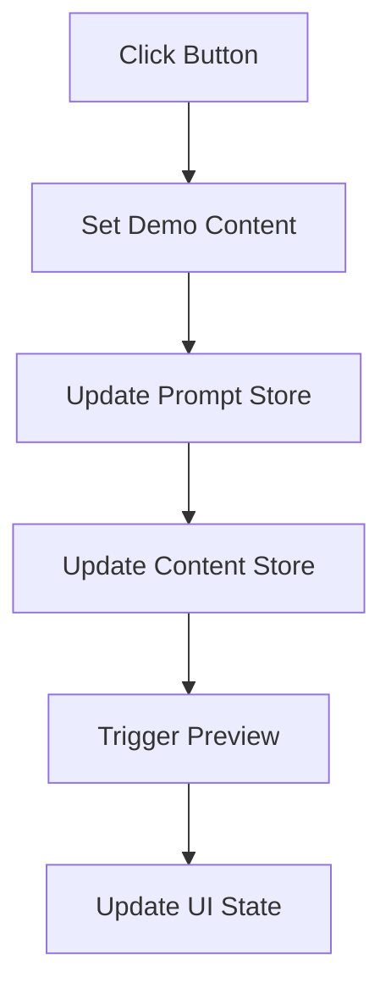
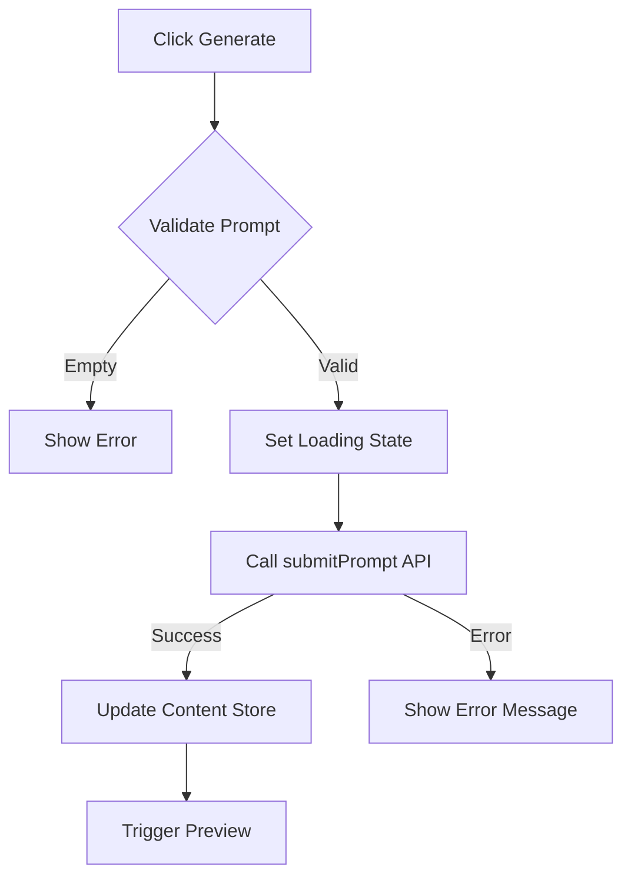
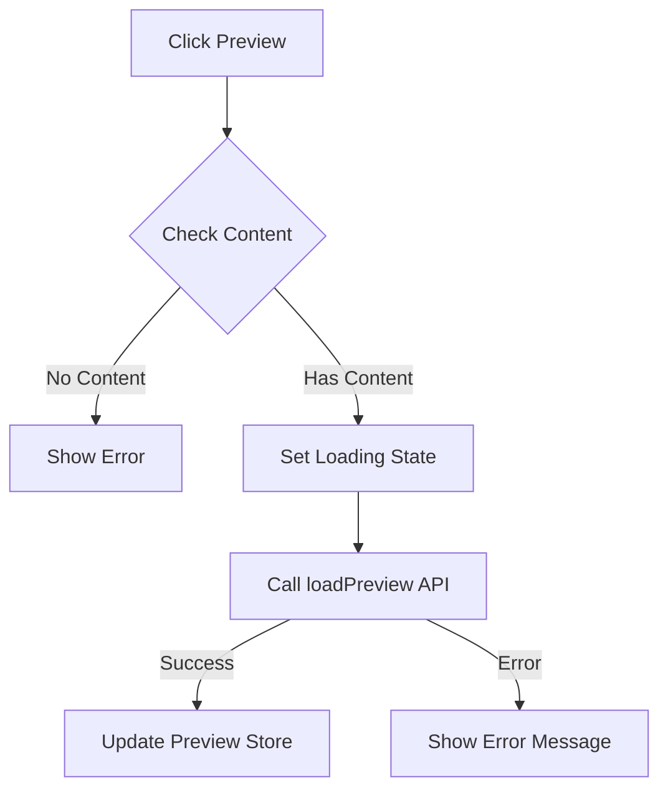
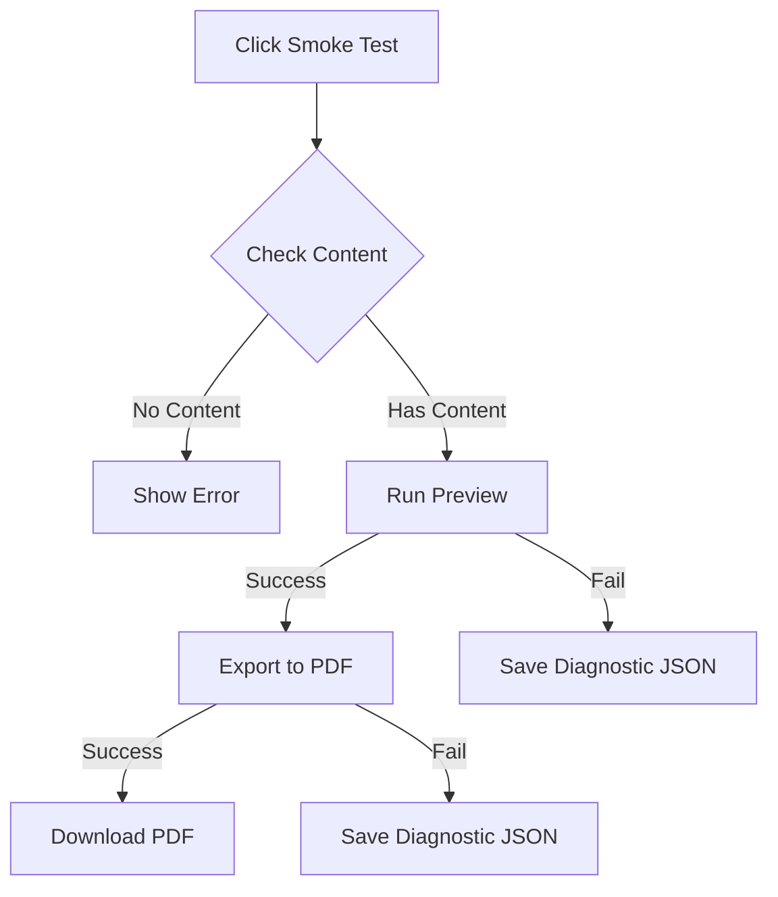

# AetherPress GUI Button Documentation

## Overview

Documentation of button functionality, process flows, dependencies, and status in the V0.1 implementation.

## Button Inventory

### 1. Summer Suggestion

**Purpose**: Quick-insert template for demonstration purposes



**Dependencies**:

- DOM access to prompt-textarea element
- promptStore for state management

**Output**: Sets textarea value to predefined summer-themed prompt
**Current Status**: ❌ FAIL - Automated test: focuses textarea but does not insert text

#### Verification Plan

Implementation verification in `PromptInput.svelte`:

1. Function behavior:

   - Should set suggestion text to the promptStore
   - Should focus the textarea after insertion

2. UI verification checklist:
   - [x] Button exists and is yellow
   - [ ] Clicking inserts text: "A short, sunlit summer poem about cicadas and long shadows."
   - [x] Textarea receives focus after text insertion

### Reproducibility Template (per-button)

Use this template to capture consistent diagnostics for each button. Copy the section and fill fields when testing.

- Button: (name)
- Component / file: (e.g. `client/src/components/PromptInput.svelte`)
- Expected behavior: (brief)
- Reproduction steps:
  1.  Start backend and frontend (`npm run dev` in `server` and `client` as required)
  2.  Open the app at `http://localhost:5173` (adjust if different)
  3.  Ensure developer console and network tab open
  4.  Perform the action (click button, provide input as noted)
- Expected network requests: (URLs and methods)
- Observed console logs / errors: (paste here)
- Observed network responses: (status, body snippets)
- Observed UI state change: (what changed in UI, if anything)
- Files referenced: (components, stores, api helpers)
- Timestamped log file: `docs/focus/logs/<button>-YYYYMMDDTHHMM.json`
- Tester: (name)
- Test result: PASS / FAIL
- Notes & next steps: (diagnostic hints)

### Summer suggestion — Reproducibility Record

- Button: Summer suggestion
- Component / file: `client/src/components/PromptInput.svelte`
- Expected behavior: Inserts the summer suggestion text into the prompt textarea and focuses it.
- Reproduction steps:
  1.  Start frontend (if not already running): `cd client && npm run dev`
  2.  Open the app in a browser at the dev host (commonly `http://localhost:5173`).
  3.  Open Developer Tools → Console and Network.
  4.  Click the `Summer suggestion` button.
- Expected network requests: none (this action should be local-only).
- Observed console logs / errors: none observed during automated run
  -- Observed network responses: (none expected)
- Observed UI state change: Textarea receives focus, but its value is NOT updated with the suggestion text
- Files referenced: `client/src/components/PromptInput.svelte`, `client/src/stores.js` (or `stores`), `client/src/lib/api.js` (for context)
- Timestamped log file: `docs/focus/logs/summer-suggestion-<timestamp>.json`
- Tester: (tester name)
  -- Test result: FAIL
- Notes & next steps:
  1.  Confirm how `PromptInput.svelte` updates the prompt: check whether it writes directly to the DOM element vs updating `promptStore`.
  2.  Verify `promptStore` export/import paths and that `PromptInput.svelte` subscribes or uses `bind:value` correctly.
  3.  Instrument the component with a console.log in the button handler to confirm the suggestion text value is produced.
  4.  Run the Playwright script and reproduce interactively: `cd client && node ../scripts/test-summer-suggestion.js --url http://localhost:5173` (or run from repo root as your environment requires).
  5.  After fixing, re-run the automated test and update this record with the timestamped JSON at `docs/focus/logs/summer-suggestion-<timestamp>.json`.

### Recent automated run (2025-09-09)

- Run: Playwright script `scripts/test-summer-suggestion.js` executed from repo root against `http://localhost:5173`.
- Report written: `docs/focus/logs/summer-suggestion-1757449538026.json`
- Observations from report:
  - `textareaValue`: "" (empty) — textarea did not reflect the inserted suggestion
  - `textareaFocused`: true — textarea received focus
  - Console includes instrumented logs: `insertSummerSuggestion: setting suggestion= A short, sunlit summer poem about cicadas and long shadows.` and `insertSummerSuggestion: focused textarea`
  - Vite dev websocket errors observed in console (remote preview / Codespaces related) but not blocking the handler execution

Next action: update the textarea binding to use the local `currentPrompt` and propagate `on:input` changes back to `promptStore`; then re-run the Playwright script and attach the new JSON file to this record.

### Recent automated run (2025-09-09) — re-run after binding change

- Run: Playwright script `scripts/test-summer-suggestion.js` executed from repo root against `http://localhost:5173` after applying `currentPrompt` binding.
- Report written: `docs/focus/logs/summer-suggestion-1757450018728.json`
- Observations from report:
  - `textareaValue`: "" (still empty) — textarea did not reflect the inserted suggestion
  - `textareaFocused`: true — textarea received focus
  - Console includes instrumented logs: `insertSummerSuggestion: setting suggestion= A short, sunlit summer poem about cicadas and long shadows.` and `insertSummerSuggestion: focused textarea`
  - No network entries captured

Conclusion: the binding change was applied and the handler executed (console logs), but Playwright still observed an empty textarea value. Next steps:

1. For immediate robustness, set the textarea's DOM value directly in the suggestion handler (e.g., `el.value = suggestion`) in addition to updating `currentPrompt` and `promptStore`.
2. Alternatively, extend the Playwright test to wait slightly longer before reading the textarea value to rule out timing races.
3. If (1) is chosen, implement the DOM write, re-run the Playwright script, and update this record with the new JSON.

A note on automated testing

The verification helper was updated to use Playwright (project uses Playwright in `client/`). The test writes a JSON report to `docs/focus/logs/` with a timestamped filename.

- Script: `scripts/test-summer-suggestion.js` (Playwright)
- Usage examples:

```bash
# from repo root
node scripts/test-summer-suggestion.js --url http://localhost:5173
# or run from client/ if your Playwright install is scoped there
cd client && node ../scripts/test-summer-suggestion.js --url http://localhost:5173
```

The script verifies two things: whether the textarea value equals the expected suggestion, and whether the textarea receives focus after clicking the button. It saves a timestamped JSON report in `docs/focus/logs/` for reproducibility.

### 2. Load V0.1 Demo

**Purpose**: Populate interface with complete demo content



**Dependencies**:

- promptStore
- contentStore
- uiStateStore
- handlePreviewNow function
- Sample content assets

**Output**:

- Sets demo text in prompt
- Loads demo content with summer poems
- Triggers preview update
  **Current Status**: ❌ FAIL - Store updates not propagating

### 3. Generate Button

**Purpose**: Process prompt and generate content



**Dependencies**:

- promptStore for input
- contentStore for output
- uiStateStore for status
- submitPrompt API endpoint
- Valid network connection

**Output**:

- Generated content based on prompt
- Updated UI state
- Automatic preview trigger
  **Current Status**: ❌ FAIL - API connection issues

### 4. Preview Button

**Purpose**: Display current content in preview format



**Dependencies**:

- contentStore with valid content
- previewStore for display
- loadPreview API endpoint
- Valid content structure {title, body}

**Output**:

- HTML preview of content
- Updated preview pane
  **Current Status**: ❌ FAIL - Store access issues

### 5. Run Smoke Test

**Purpose**: Validate preview to export workflow



**Dependencies**:

- contentStore with valid content
- handlePreviewNow function
- exportToPdf API endpoint
- Blob API for diagnostics
- File system access for downloads

**Output**:

- Success: Downloaded PDF
- Failure: Diagnostic JSON file
  **Current Status**: ❌ FAIL - Preview and export chain broken

## Technical Dependencies Map

```mermaid
graph LR
    A[Button Events] --> B[Svelte Stores]
    B --> C[API Layer]
    C --> D[Backend Services]

    subgraph "Frontend State"
        B
        E[promptStore]
        F[contentStore]
        G[uiStateStore]
        H[previewStore]
    end

    subgraph "API Endpoints"
        I[/prompt]
        J[/preview]
        K[/export]
    end
```

## Common Failure Points

1. Store Connection

   - Store subscriptions not initializing
   - State updates not propagating

2. API Integration

   - Endpoint connectivity issues
   - Response handling failures

3. Event Chain

   - Broken promise chains
   - Unhandled error states

4. Resource Access
   - File system permissions
   - Network request failures

## Required Fixes Summary

1. Store Initialization

   - Ensure proper store setup
   - Verify subscription methods

2. API Integration

   - Validate endpoint connections
   - Implement proper error handling

3. Event Handlers

   - Complete promise chains
   - Add error boundaries

4. Resource Management
   - Handle file system access properly
   - Implement request timeouts
