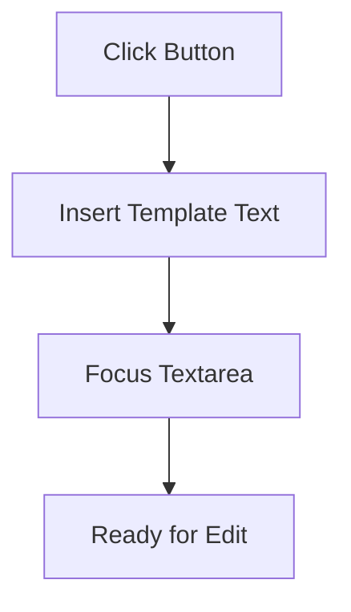
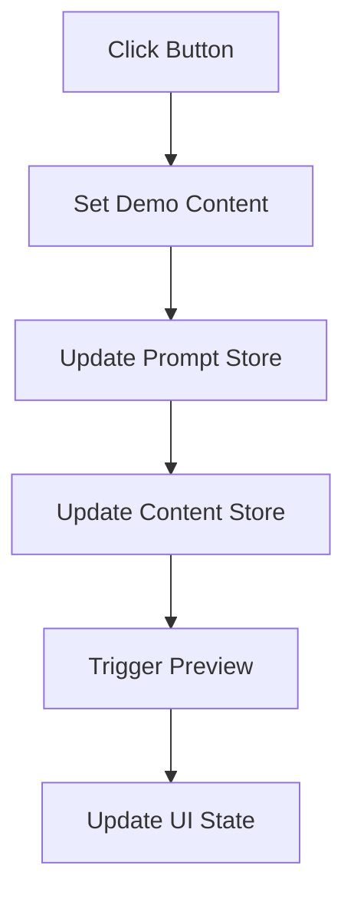
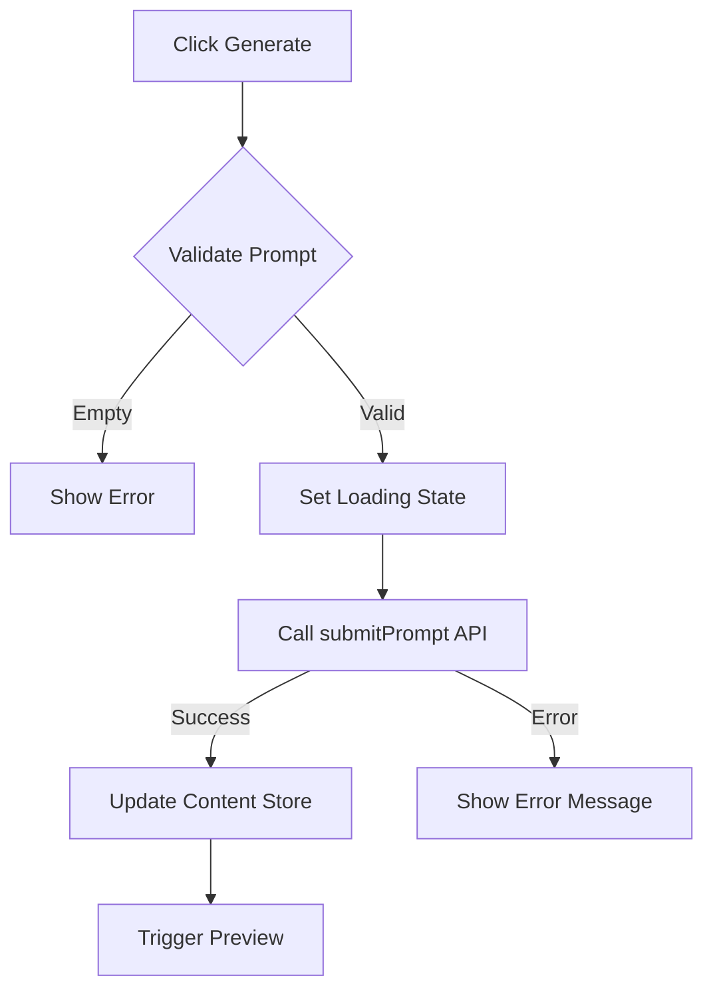
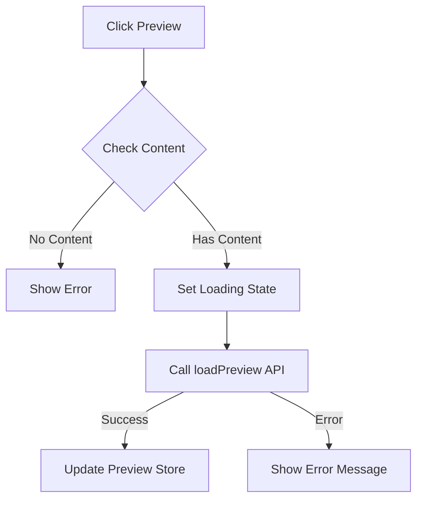
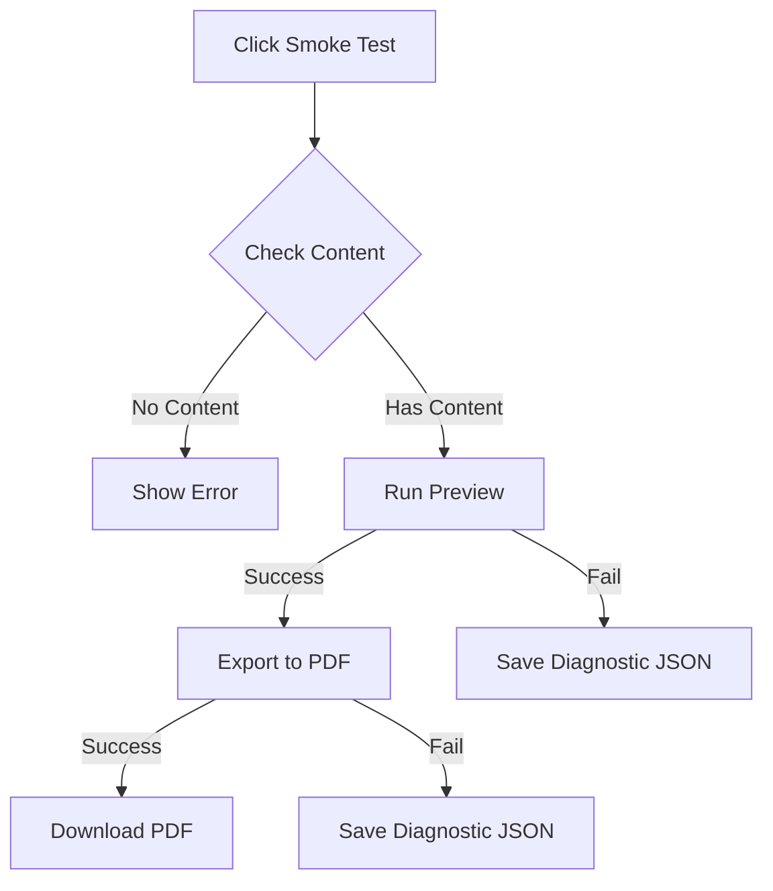

# AetherPress GUI Button Documentation

## Overview

Documentation of button functionality, process flows, dependencies, and status in the V0.1 implementation.

## Button Inventory

### 1. Summer Suggestion

**Purpose**: Quick-insert template for demonstration purposes



**Dependencies**:

- DOM access to prompt-textarea element
- promptStore for state management

**Output**: Sets textarea value to predefined summer-themed prompt
**Current Status**: ❌ FAIL - Event handler likely not connecting to store

#### Verification Plan

Implementation verification in `PromptInput.svelte`:

1. Function behavior:

   - Should set suggestion text to the promptStore
   - Should focus the textarea after insertion

2. UI verification checklist:
   - [x] Button exists and is yellow
   - [ ] Clicking inserts text: "A short, sunlit summer poem about cicadas and long shadows."
   - [ ] Textarea receives focus after text insertion

### 2. Load V0.1 Demo

**Purpose**: Populate interface with complete demo content



**Dependencies**:

- promptStore
- contentStore
- uiStateStore
- handlePreviewNow function
- Sample content assets

**Output**:

- Sets demo text in prompt
- Loads demo content with summer poems
- Triggers preview update
  **Current Status**: ❌ FAIL - Store updates not propagating

### 3. Generate Button

**Purpose**: Process prompt and generate content



**Dependencies**:

- promptStore for input
- contentStore for output
- uiStateStore for status
- submitPrompt API endpoint
- Valid network connection

**Output**:

- Generated content based on prompt
- Updated UI state
- Automatic preview trigger
  **Current Status**: ❌ FAIL - API connection issues

### 4. Preview Button

**Purpose**: Display current content in preview format



**Dependencies**:

- contentStore with valid content
- previewStore for display
- loadPreview API endpoint
- Valid content structure {title, body}

**Output**:

- HTML preview of content
- Updated preview pane
  **Current Status**: ❌ FAIL - Store access issues

### 5. Run Smoke Test

**Purpose**: Validate preview to export workflow



**Dependencies**:

- contentStore with valid content
- handlePreviewNow function
- exportToPdf API endpoint
- Blob API for diagnostics
- File system access for downloads

**Output**:

- Success: Downloaded PDF
- Failure: Diagnostic JSON file
  **Current Status**: ❌ FAIL - Preview and export chain broken

## Technical Dependencies Map

```mermaid
graph LR
    A[Button Events] --> B[Svelte Stores]
    B --> C[API Layer]
    C --> D[Backend Services]

    subgraph "Frontend State"
        B
        E[promptStore]
        F[contentStore]
        G[uiStateStore]
        H[previewStore]
    end

    subgraph "API Endpoints"
        I[/prompt]
        J[/preview]
        K[/export]
    end
```

## Common Failure Points

1. Store Connection

   - Store subscriptions not initializing
   - State updates not propagating

2. API Integration

   - Endpoint connectivity issues
   - Response handling failures

3. Event Chain

   - Broken promise chains
   - Unhandled error states

4. Resource Access
   - File system permissions
   - Network request failures

## Required Fixes Summary

1. Store Initialization

   - Ensure proper store setup
   - Verify subscription methods

2. API Integration

   - Validate endpoint connections
   - Implement proper error handling

3. Event Handlers

   - Complete promise chains
   - Add error boundaries

4. Resource Management
   - Handle file system access properly
   - Implement request timeouts
