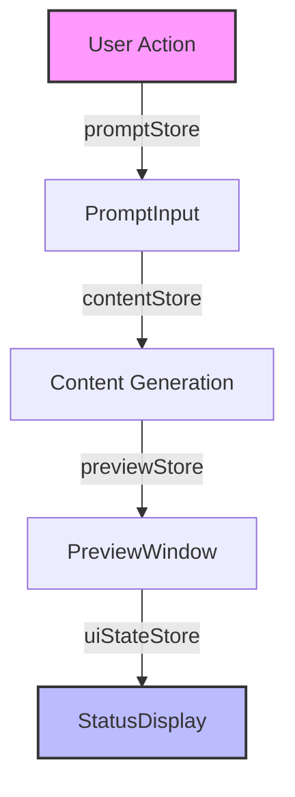

# UI Responsiveness Fix Plan

## Current Observations

### 1. State Management Issues

- Multiple Svelte stores (`promptStore`, `contentStore`, `previewStore`, `uiStateStore`) have potential propagation gaps
- Store updates may not be completing their full update cycle
- Store subscriptions might be dropping updates due to race conditions

### 2. Visual Feedback Gaps

- Status Display transitions may be too subtle
- Loading states lack visual prominence
- Success/error states may not persist long enough to be noticed
- No immediate feedback for user actions

### 3. Component Communication Chain

Chain breaks identified in:

- Content generation → Preview update
- Preview update → Status display
- Status display → Visual feedback

### 4. Timing Issues

- Debounce timing (350ms) may be too long for perceived responsiveness
- Race conditions between store updates
- Async operation feedback not immediately visible

## Implementation Plan

### Phase 1: Immediate Visual Feedback

1. Update StatusDisplay.svelte

   - Increase opacity and contrast of status messages
   - Add persistent success/error states
   - Implement a loading spinner component
   - Add progress indicators for long operations

2. Add Transition States
   - Implement button loading states
   - Add disabled states during operations
   - Show spinner overlays for loading content
   - Add visual transitions between states

### Phase 2: Store Management Enhancement

1. Store Updates Verification

   - Add store update logging in development
   - Implement store update completion tracking
   - Add store subscription debugger

2. Store Timing Optimization
   - Reduce debounce timing to 200ms
   - Add immediate acknowledgment of state changes
   - Implement optimistic UI updates

### Phase 3: Component Communication

1. Event Flow Enhancement

   - Add event tracking between components
   - Implement explicit success/failure handlers
   - Add rollback mechanisms for failed operations

2. User Feedback Loop
   - Add progress indicators for all async operations
   - Implement step completion notifications
   - Add visual confirmation of action receipt

## Testing Protocol

### 1. Visual Feedback Tests

- [ ] Status messages visible and legible
- [ ] Loading states clearly indicated
- [ ] Success/error states persist appropriately
- [ ] Transitions smooth and noticeable

### 2. Store Update Tests

- [ ] Store updates complete in expected order
- [ ] No dropped updates during rapid changes
- [ ] Proper error state propagation
- [ ] Consistent state across components

### 3. User Interaction Tests

- [ ] Immediate feedback on all user actions
- [ ] Clear indication of processing status
- [ ] Proper disable states during operations
- [ ] Smooth transition between states

## Success Metrics

1. Visibility

   - All state changes visible to user
   - Loading states immediately apparent
   - Success/error messages persist for 3 seconds minimum

2. Responsiveness

   - Button state changes within 100ms
   - Loading indicators appear within 50ms
   - Preview updates within 500ms
   - Status updates within 200ms

3. Reliability
   - No dropped state updates
   - Consistent store state across components
   - Proper error handling and display
   - Smooth transitions between all states

## Implementation Priority

1. High Priority (Week 1)

   - Status Display enhancement
   - Loading state visibility
   - Immediate feedback implementation

2. Medium Priority (Week 2)

   - Store timing optimization
   - Component communication enhancement
   - Progress indicators

3. Low Priority (Week 3)
   - Advanced transitions
   - Store debugging tools
   - Performance optimization

## Monitoring and Validation

1. Development Phase

   - Store update logging
   - Component render tracking
   - State transition timing
   - User action response timing

2. Testing Phase

   - Automated UI response tests
   - Manual interaction testing
   - Store consistency validation
   - Visual feedback verification

3. Production Phase
   - User interaction metrics
   - Error rate monitoring
   - Performance tracking
   - Feedback collection

---

This plan prioritizes user perception of responsiveness while systematically addressing the underlying technical issues. Implementation should proceed in phases, with each phase validated before moving to the next.
