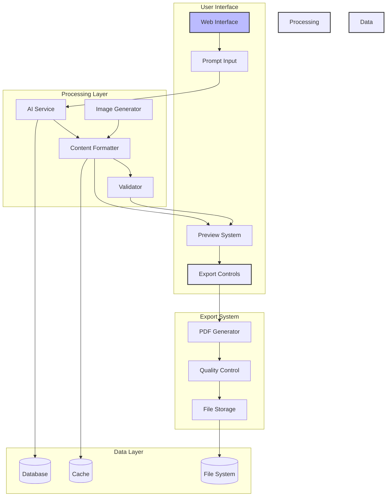
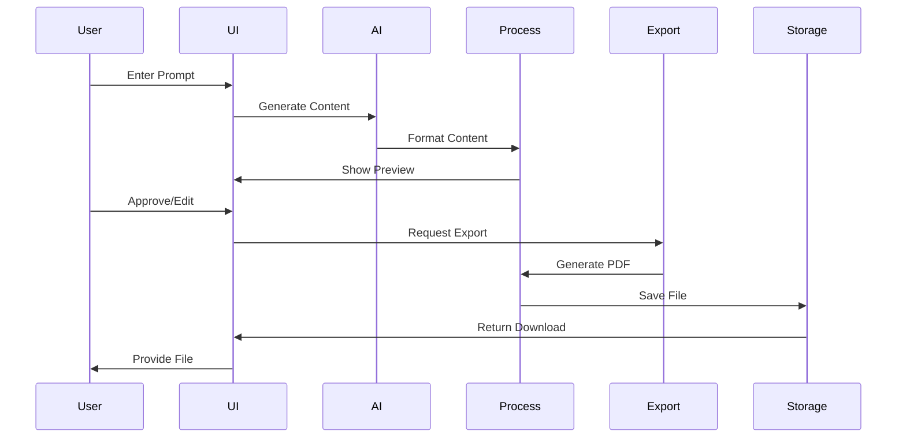
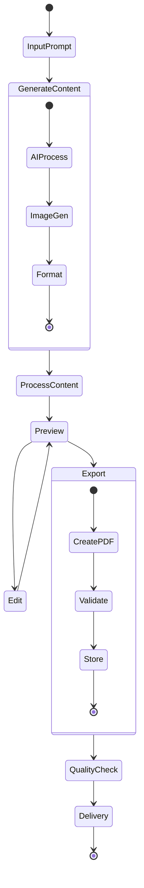
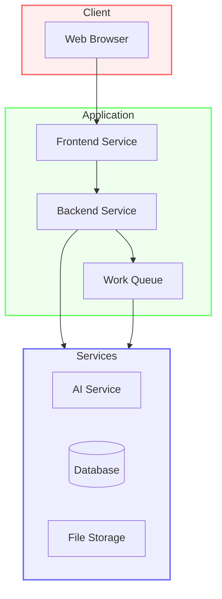

# AetherPress System Architecture Diagram

## System Overview



## Data Flow



## Component Architecture

```mermaid
graph TB
    subgraph Frontend Layer
        UI[User Interface]
        State[State Management]
        API[API Client]
    end

    subgraph Backend Layer
        Server[Express Server]
        Services[Core Services]
        Queue[Job Queue]
    end

    subgraph External Services
        AI[AI Model]
        Storage[File Storage]
        DB[(Database)]
    end

    UI --> State
    State --> API
    API --> Server
    Server --> Services
    Services --> Queue
    Services --> External Services
    Queue --> External Services

    style Frontend Layer fill:#bbf,stroke:#333,stroke-width:2px
    style Backend Layer fill:#f9f,stroke:#333,stroke-width:2px
    style External Services fill:#dfd,stroke:#333,stroke-width:2px
```

## Process Flow



## Deployment Architecture


