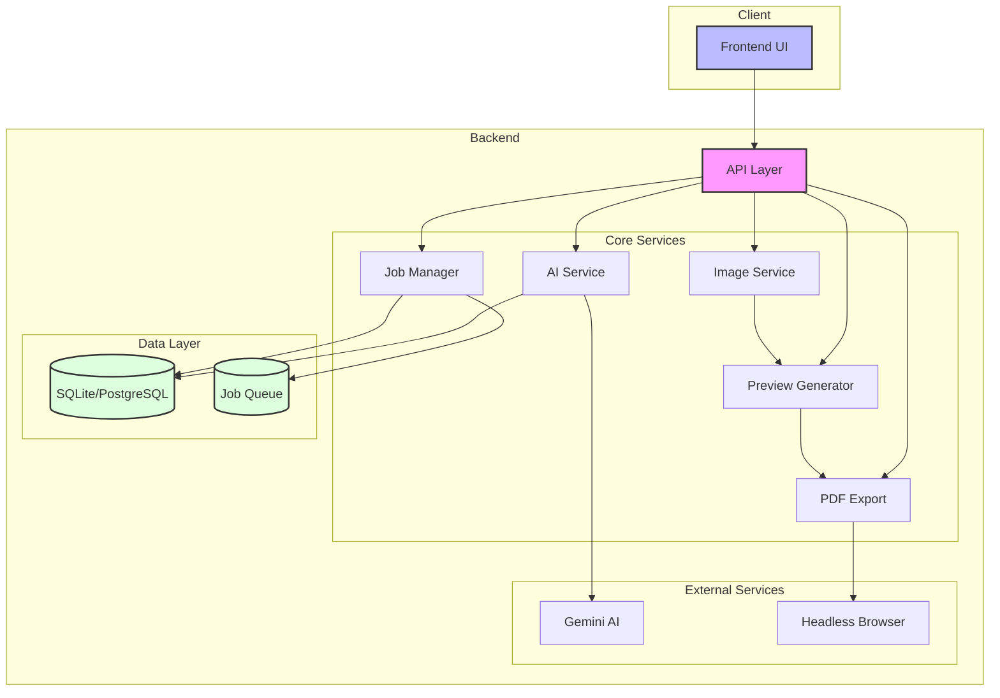
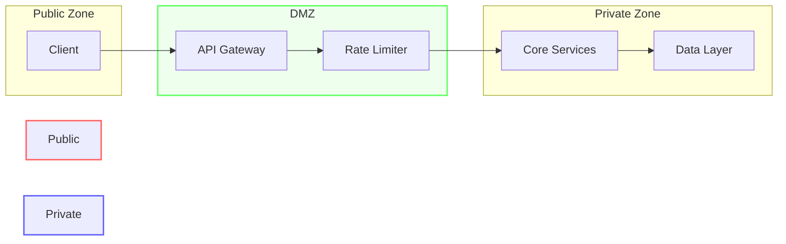

# AetherPress Backend Architecture Diagram

## Component Interactions

### Data Flow

1. Client sends request to API Layer
2. API Layer routes to appropriate service:
   - Prompts → AI Service
   - Preview requests → Preview Generator
   - Export requests → PDF Export/Job Manager
3. Services interact with data layer as needed
4. Results returned to client via API Layer

### Service Communication

- **AI Service** ↔ Gemini: Content/image generation
- **Preview Generator** ← Image Service: Asset processing
- **PDF Export** ↔ Headless Browser: PDF generation
- **Job Manager** ↔ Queue: Background task handling

### State Management

- Database stores application data
- Job queue manages export tasks
- Memory cache for active operations
- File system for temporary assets

## Security Boundaries

### Security Measures

1. Rate limiting on API endpoints
2. Input validation at API layer
3. Sanitization of user content
4. Access control for sensitive operations
