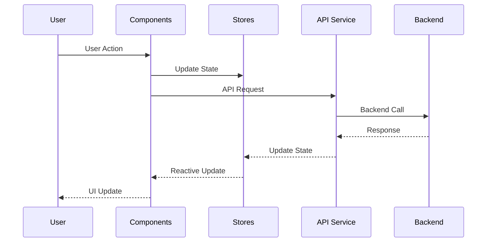
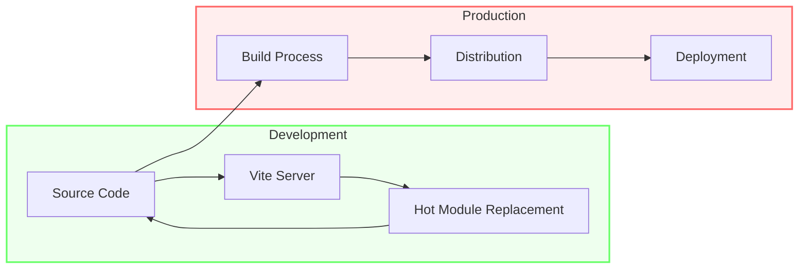

# AetherPress Frontend Architecture Diagram

```mermaid
graph TB
    subgraph Frontend
        UI[User Interface]

        subgraph Components
            PI[PromptInput]
            PW[PreviewWindow]
            OC[OverrideControls]
            EB[ExportButton]
            SD[StatusDisplay]
        end

        subgraph State Management
            PS[Prompt Store]
            CS[Content Store]
            USS[UI State Store]
            PRS[Preview Store]
        end

        subgraph Services
            API[API Service]
            VAL[Validation]
        end
    end

    subgraph Backend
        BE[Backend API]
    end

    UI --> Components
    Components --> State Management
    Components --> Services
    Services --> BE
    BE --> Services
    Services --> State Management
    State Management --> Components

    style UI fill:#bbf,stroke:#333,stroke-width:2px
    style Components fill:#f9f,stroke:#333,stroke-width:2px
    style State Management fill:#dfd,stroke:#333,stroke-width:2px
    style Services fill:#ffd,stroke:#333,stroke-width:2px
```

## Component Interactions

### Data Flow

1. User interacts with Components
2. Components update State Management
3. Services communicate with Backend
4. State updates trigger Component re-renders

### Component Communication

- **PromptInput** ↔ Prompt Store
- **PreviewWindow** ↔ Preview Store
- **OverrideControls** ↔ Content Store
- **ExportButton** ↔ UI State Store
- **StatusDisplay** ← UI State Store

### State Management Flow



## Component Architecture

```mermaid
graph TD
    subgraph App Component
        Main[App.svelte]
        Layout[Layout Structure]
    end

    subgraph Core Components
        PI[PromptInput]
        PW[PreviewWindow]
        OC[OverrideControls]
        EB[ExportButton]
        SD[StatusDisplay]
    end

    subgraph Stores
        PS[promptStore]
        CS[contentStore]
        USS[uiStateStore]
        PRS[previewStore]
    end

    Main --> Layout
    Layout --> Core Components
    Core Components --> Stores
    Stores --> Core Components

    style App Component fill:#f9f,stroke:#333,stroke-width:2px
    style Core Components fill:#bbf,stroke:#333,stroke-width:2px
    style Stores fill:#dfd,stroke:#333,stroke-width:2px
```

### Development Flow


